# POTION PANIC - Class Diagram & OOP Architecture

เอกสารโครงสร้างสถาปัตยกรรมเชิงวัตถุ (Object-Oriented Programming) สำหรับเกม **POTION PANIC (อลวนคนปรุงยา)**

---

## 1. รหัส Mermaid Class Diagram ฉบับสมบูรณ์ (Full Architecture)

คุณสามารถนำโค้ดบล็อกนี้ไปแสดงผลใน **GitHub Markdown**, **Notion**, หรือเว็บ [Mermaid Live Editor](https://mermaid.live) ได้ทันที

```mermaid
classDiagram
    direction TB

    %% ==========================================
    %% 1. INTERFACES (การแยกส่วนนามธรรม)
    %% ==========================================
    class Renderable {
        <<interface>>
        +render(Graphics2D g) void
    }

    class Damageable {
        <<interface>>
        +takeDamage(int amount) void
        +isDead() boolean
        +getHp() int
        +getMaxHp() int
    }

    %% ==========================================
    %% 2. ENTITIES (หอคอย และ มอนสเตอร์)
    %% ==========================================
    class Tower {
        -int hp
        -int maxHp
        -double x
        -double y
        +takeDamage(int amount) void
        +repair(int amount) void
        +isDead() boolean
        +render(Graphics2D g) void
    }
    Renderable <|.. Tower
    Damageable <|.. Tower

    class Monster {
        <<abstract>>
        #double x
        #double y
        #double speed
        #int hp
        #int maxHp
        #int attackPower
        #ElementType weakness
        #Map~StatusEffect, Double~ statusDurations
        +update(double dt) void
        +render(Graphics2D g) void
        +takeElementalDamage(int amount, ElementType el) void
        +applyStatus(StatusEffect effect, double duration) void
        +isDead() boolean
        +getHp() int
        +getMaxHp() int
        +getWeakness() ElementType
    }
    Renderable <|.. Monster
    Damageable <|.. Monster

    class FireGolem {
        +FireGolem(double x, double y)
        +update(double dt) void
    }
    class PlantCreeper {
        +PlantCreeper(double x, double y)
        +update(double dt) void
    }
    class ArmoredBeast {
        +ArmoredBeast(double x, double y)
        +update(double dt) void
    }
    class SwiftImp {
        +SwiftImp(double x, double y)
        +update(double dt) void
    }
    Monster <|-- FireGolem
    Monster <|-- PlantCreeper
    Monster <|-- ArmoredBeast
    Monster <|-- SwiftImp

    %% ==========================================
    %% 3. POTIONS & PROJECTILES (ระบบขวดยาและการขว้าง)
    %% ==========================================
    class Potion {
        <<abstract>>
        #String name
        #ElementType element
        #int baseDamage
        #double splashRadius
        #Color flaskColor
        +getName() String
        +getElement() ElementType
        +getBaseDamage() int
        +getSplashRadius() double
        +getFlaskColor() Color
        +render(Graphics2D g) void
        +onHit(Monster target, List~Monster~ nearby)* void
    }
    Renderable <|.. Potion

    class FirePotion {
        +onHit(Monster target, List~Monster~ nearby) void
    }
    class IcePotion {
        +onHit(Monster target, List~Monster~ nearby) void
    }
    class PoisonPotion {
        +onHit(Monster target, List~Monster~ nearby) void
    }
    class LightningPotion {
        +onHit(Monster target, List~Monster~ nearby) void
    }
    class ExplosivePotion {
        +onHit(Monster target, List~Monster~ nearby) void
    }
    class FailedPotion {
        +onHit(Monster target, List~Monster~ nearby) void
    }
    Potion <|-- FirePotion
    Potion <|-- IcePotion
    Potion <|-- PoisonPotion
    Potion <|-- LightningPotion
    Potion <|-- ExplosivePotion
    Potion <|-- FailedPotion

    class Projectile {
        -Potion potion
        -double currentX
        -double currentY
        -double targetX
        -double targetY
        -double progress
        +update(double dt) void
        +render(Graphics2D g) void
        +isArrived() boolean
        +explode(List~Monster~ monsters) void
    }
    Renderable <|.. Projectile
    Projectile o-- Potion

    %% ==========================================
    %% 4. ITEMS & ALCHEMY (ระบบการปรุงยาและโต๊ะทำงาน)
    %% ==========================================
    class IngredientType {
        <<enumeration>>
        RED_HERB
        BLUE_CRYSTAL
        TOXIC_MUSHROOM
        THUNDER_ROOT
        +getName() String
        +getElement() ElementType
        +getColor() Color
    }

    class Cauldron {
        -List~IngredientType~ ingredients
        -double explosionTimer
        +addIngredient(IngredientType ing) boolean
        +removeLastIngredient() IngredientType
        +brewPotion() Potion
        +clear() void
        +isExploded() boolean
        +update(double dt) void
        +render(Graphics2D g) void
    }
    Renderable <|.. Cauldron
    Cauldron o-- IngredientType
    Cauldron ..> RecipeBook : calls

    class ConveyorBelt {
        -IngredientType[] slots
        -double refillTimer
        +takeIngredient(int index) IngredientType
        +update(double dt) void
        +render(Graphics2D g) void
    }
    Renderable <|.. ConveyorBelt
    ConveyorBelt o-- IngredientType

    class PotionRack {
        -Potion[] slots
        -int selectedIndex
        +addPotion(Potion p) boolean
        +useSelectedPotion() Potion
        +selectSlot(int index) void
        +render(Graphics2D g) void
    }
    Renderable <|.. PotionRack
    PotionRack o-- Potion

    class RecipeBook {
        +isValidRecipe(List~IngredientType~ ingredients)$ boolean
        +previewCraft(List~IngredientType~ ingredients)$ Potion
        +craft(List~IngredientType~ ingredients)$ Potion
    }
    RecipeBook ..> Potion : creates

    %% ==========================================
    %% 5. CORE ENGINE & MANAGERS
    %% ==========================================
    class GameEngine {
        -Tower tower
        -Cauldron cauldron
        -ConveyorBelt belt
        -PotionRack rack
        -WaveManager waveManager
        -StageConfig currentStage
        -List~Monster~ monsters
        -List~Projectile~ projectiles
        -int score
        -int comboStreak
        +update(double dt) void
        +throwPotion(double targetX, double targetY) void
        +pickIngredient(int index) void
        +brew() void
        +checkCollisions() void
    }
    GameEngine *-- Tower
    GameEngine *-- Cauldron
    GameEngine *-- ConveyorBelt
    GameEngine *-- PotionRack
    GameEngine *-- WaveManager
    GameEngine o-- Monster
    GameEngine o-- Projectile

    class WaveManager {
        -int currentWave
        -int totalWaves
        -double spawnCooldown
        +update(double dt, List~Monster~ monsters, StageConfig cfg) void
        +isWaveCleared() boolean
        +isAllWavesComplete() boolean
    }

    class StageConfig {
        -int stageNumber
        -String title
        -String subtitle
        -List~IngredientType~ allowedIngredients
        -int totalWaves
        -boolean endless
        +forStage(int num)$ StageConfig
        +getShortTitle() String
    }

    class ProfileManager {
        -int starPoints
        -Map~Integer, Integer~ stageStars
        -Map~UpgradeType, Integer~ upgradeLevels
        +getInstance()$ ProfileManager
        +buyUpgrade(UpgradeType type) boolean
        +getBonusTowerHp() int
        +getBonusBeltSpeed() double
    }

    class SoundManager {
        +getInstance()$ SoundManager
        +playMagicChime(double freq, double dur) void
        +playBubbleTone() void
        +playCombo(int combo) void
        +updateLowHpAlert(boolean active) void
    }

    %% ==========================================
    %% 6. UI LAYER (หน้าจอ Swing)
    %% ==========================================
    class GameWindow {
        -CardLayout cardLayout
        -JPanel mainContainer
        +showScreen(String name) void
        +startStage(int stageNumber) void
    }

    class GameplayPanel {
        -GameEngine engine
        +paintComponent(Graphics g) void
    }

    class StageSelectPanel {
        -int selectedStage
        +paintComponent(Graphics g) void
    }

    class VictoryPanel {
        -int earnedStars
        +paintComponent(Graphics g) void
    }

    class GameOverPanel {
        -int finalScore
        +paintComponent(Graphics g) void
    }

    GameWindow *-- GameplayPanel
    GameWindow *-- StageSelectPanel
    GameWindow *-- VictoryPanel
    GameWindow *-- GameOverPanel
    GameplayPanel --> GameEngine
    StageSelectPanel ..> ProfileManager : uses
    GameplayPanel ..> SoundManager : calls
```

---

## 2. การประยุกต์ใช้หลักการเชิงวัตถุ (OOP Concepts Applied)

| หลักการ OOP | รูปแบบที่ใช้งานในเกม POTION PANIC | ประโยชน์ |
| :--- | :--- | :--- |
| **Abstraction** | อินเทอร์เฟซ `Renderable`, `Damageable` และคลาสแม่ `Monster`, `Potion` | แยกสัญญาการทำงาน (Contract) ออกจากรายละเอียดภายใน ทำให้ `GameEngine` สั่งวาดหรือสร้างความเสียหายได้โดยไม่ต้องรู้ชนิดเฉพาะ |
| **Inheritance** | `Monster` $\rightarrow$ `FireGolem`, `PlantCreeper`, `ArmoredBeast`, `SwiftImp` `Potion` $\rightarrow$ `FirePotion`, `IcePotion`, `PoisonPotion` ฯลฯ | รียูสโค้ดตำแหน่ง การเคลื่อนที่ เลือด และการวาดภาพ ลดความซ้ำซ้อนของโค้ด |
| **Polymorphism** | เมธอด `onHit(...)` ในแต่ละคลาสลูกของ `Potion` เมธอด `update()` และ `takeElementalDamage(...)` ใน `Monster` | ขวดยาแต่ละชนิดมีเอฟเฟกต์เฉพาะตัว (เผา, แช่แข็ง, สตั๊น, ระเบิดวงกว้าง) โดยถูกเรียกผ่านตัวแปรประเภทแม่ `Potion` ได้ทันที |
| **Encapsulation** | ฟิลด์ข้อมูลทั้งหมดเป็น `private`/`protected` มีการเข้าถึงผ่าน Getter/Setter | ป้องกันการแก้ไขค่าพลังชีวิต สล็อตวัตถุดิบ หรือจำนวนดาวจากภายนอกโดยไม่ผ่านการคำนวณที่ถูกต้อง |
| **Composition & Aggregation** | `GameEngine` ประกอบด้วย `Tower`, `Cauldron`, `PotionRack`, `ConveyorBelt`, `WaveManager` | การประกอบอ็อบเจกต์ย่อยที่มีหน้าที่จำเพาะ (Single Responsibility) มารวมเป็นระบบเกมที่ทรงพลัง |
| **Singleton Pattern** | `ProfileManager.getInstance()`, `SoundManager.getInstance()` | มีศูนย์กลางจัดการข้อมูลเซฟเกมและระบบเสียงเพียงจุดเดียวตลอดการทำงานของแอปพลิเคชัน |
